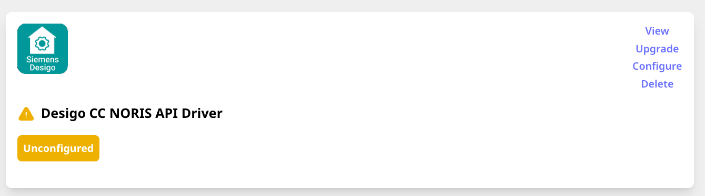
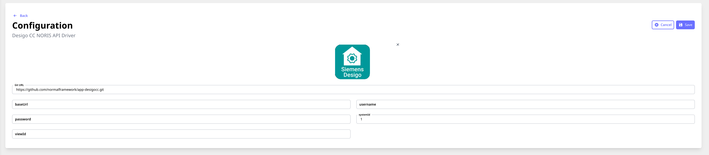
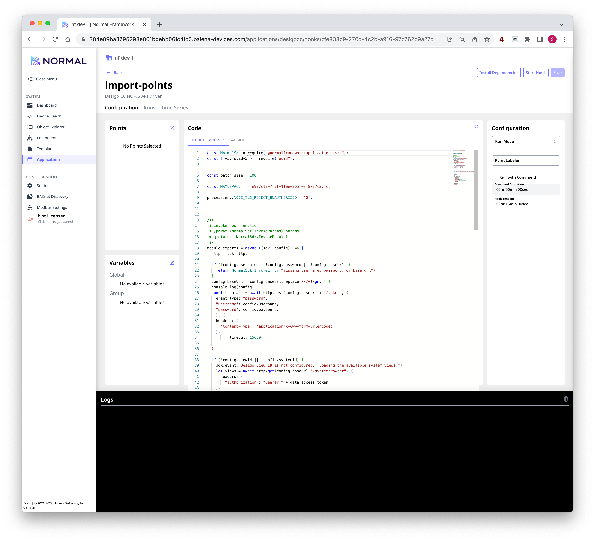

Desigo CC Integration 
===

This repository contains a Normal app for integrating with the Siemens Desigo CC "NORIS" API, and has been tested against version 6 of that application.

It supports importing points from the Desigo `systembrowser` API, and polling those points using the `values` service.

Installation and Setup
---

The application can be installed on any Normal installation (version 3 or higher) using the GitHub URL.

After installation, the app will be in the "Unconfigured state".

Click the "Configure" link to bring up the configuration, and fill in the configuration.

* `baseUrl` should be the base url of the NORIS API (for instance, `https://10.0.1.0/SiteName/api`)
* `username` and `password` should be for an account authorized to use the NORIS API.  Consult the Siemens documentation for more information on how to create this account.
* `systemId` should be set to the desired Desigo System ID.  This is usually `1`.
* `viewId` should be set to the view ID to use when importing points.

*If you don't know the view id*, set the `viewId` to `0`; and the app will print a list of available views.

Importing the Points List
---

You must import the points list once before any points will be visible in the Object Explorer.

1. Click the "View" button on the application tile to bring up the list of hooks.
2. Click "Edit" on the `import-points` hook.

.

3. Once you've configured the app (possibly except for the `viewId`), Run the `import-points` hook.  Check the logs for any errors such as an error connecting to the API or an invalid account name.  If the connection works, you will see either a list of views; or a process of importing all points from the API.

Configuring Trending
---

After you have imported the points, you can configured which points will be trended (using the `values` API) as usual, using the Object Explorer.  The `trend-points` hook will read the present values in batch from the Desigo "Values" API and update the values in Normal Framework.
